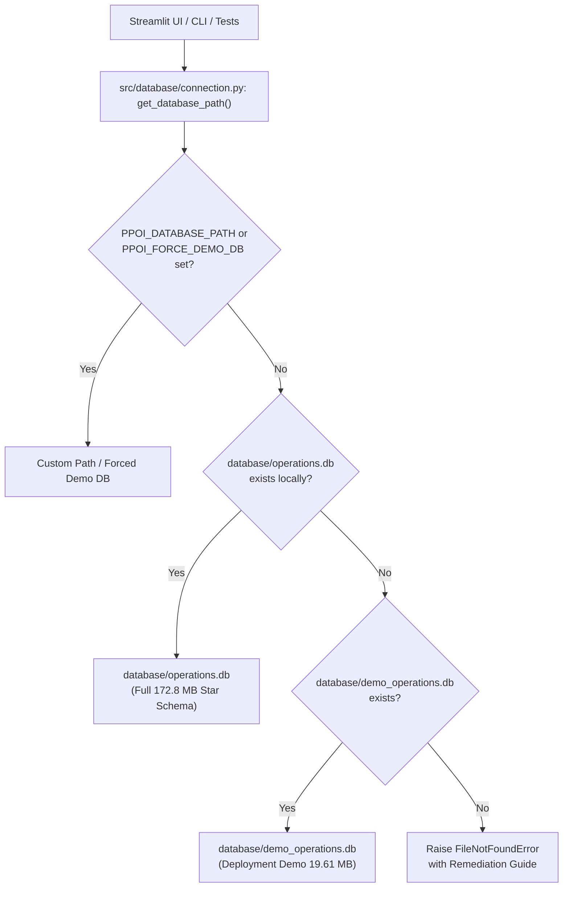

# Streamlit Cloud Deployment & Architecture Remediation Report
**Project:** Predictive → Prescriptive Operations Intelligence (PPOI)  
**Status:** Certified Deployment Ready  
**Date:** October 6, 2026  
**Target Environment:** Streamlit Community Cloud & GitHub Repository  

---

## 1. Executive Summary & Root Cause Analysis

Prior to this remediation, deployment of the PPOI portfolio platform to Streamlit Community Cloud encountered critical runtime and deployment failures. Investigation of the deployment logs, repository configuration, and runtime environment revealed three distinct root causes:

### Root Cause 1: Unpinned Python Runtime (Python 3.14 Default Incompatibility)
* **Mechanism:** Streamlit Community Cloud builds repositories without an explicit runtime specification using its latest available container environment (Python 3.14).
* **Failure Mode:** Python 3.14 introduces breaking ABI and C-extension changes for numerical packages. Optional binary wheels for data analytics dependencies (such as C-compiled extensions and pandas parquet engines) raised `ModuleNotFoundError` during container startup.
* **Remediation:** Explicitly pinned the build runtime to **Python 3.12.10** across both modern and legacy buildpacks via `.python-version` and `runtime.txt`.

### Root Cause 2: Missing SQLite Operational Database (GitHub File Limit Constraint)
* **Mechanism:** The certified star-schema operational database (`database/operations.db`) is 172.77 MB. GitHub strictly rejects any file commit exceeding 100 MB. Consequently, `database/*.db` was ignored in `.gitignore`, leaving the cloned cloud container with no database file.
* **Failure Mode:** When navigating to the **Prescriptive Operations Optimization** page or the **Inventory & Supplier Risk** fallback query, SQLite threw:
  ```text
  sqlite3.OperationalError: unable to open database file
  ```
* **Remediation:** Engineered a lightweight, deterministic analytical extract (`database/demo_operations.db` at **19.61 MB**) and a central database resolver (`src/database/connection.py`) with automatic fallback. Configured `.gitignore` to track `demo_operations.db` while continuing to ignore the 172.8 MB local database.

### Root Cause 3: Missing Parquet Engine Dependency in Clean Environments
* **Mechanism:** Local development environments utilized `pyarrow 17.0.0` for reading parquet feature stores and risk prediction artifacts (`operational_risk_priorities.parquet`), but `pyarrow` was omitted from `requirements.txt`.
* **Failure Mode:** On a clean cloud build, `pd.read_parquet` fails with `ImportError: Unable to find a usable engine; 'pyarrow' or 'fastparquet' is required`.
* **Remediation:** Added `pyarrow>=17.0.0` to `requirements.txt`.

---

## 2. Architectural Design & Implementation

### 2.1 Centralized Database Resolver (`src/database/connection.py`)
To prevent hardcoded filesystem paths and guarantee seamless operation in both local research mode (full 172.8 MB database) and cloud deployment mode (19.61 MB demo database), a central resolver was implemented.



**Key Interfaces:**
* `get_database_path() -> Path`: Resolves database path by priority (Env Override → Full DB → Demo DB → Explicit Error).
* `get_connection(db_path=None, readonly=False, timeout=10.0) -> sqlite3.Connection`: Connects with `PRAGMA foreign_keys = ON;`.
* `is_demo_database(db_path=None) -> bool`: Returns `True` if active database is the demo extract.
* `get_database_mode_label(db_path=None) -> str`: Returns `"DEPLOYMENT DEMO DATABASE"` or `"FULL DATABASE"`.
* `get_database_info() -> Dict[str, Any]`: Returns structured operational telemetry (mode, file, size in MB, table count).

### 2.2 Deterministic Demo Database (`database/demo_operations.db`)
Created via `scripts/create_demo_database.py`. The demo database satisfies all operational requirements:

| Metric / Attribute | Specification | Verified Status |
| :--- | :--- | :--- |
| **File Size** | Strict GitHub limit < 100 MB; Target < 25 MB | **19.61 MB** (20,557,824 bytes) — **PASS** |
| **Referential Integrity** | `PRAGMA foreign_key_check` | **0 violations** — **PASS** |
| **Relational Objects** | Exact Star Schema Equivalence | **25 tables, 4 views, 32 B-tree indexes** |
| **Dimension Coverage** | 100% full extract of master entities | **60 SKUs, 8 suppliers, 4 warehouses, 6 markets, 731 dates, 7 events** |
| **Phase 9 Optimization** | 100% full extract of prescriptive artifacts | **All runs, decisions, constraints, scenarios, and explanations** |
| **Analytics Slices** | Recent operational horizon (`date >= '2025-11-15'`) | **9,840 exposure rows; 11,280 inventory rows; 16,908 demand rows** |
| **Data Provenance** | Zero synthetic fabrication at runtime | **100% deterministic slice of certified operational DB** |

### 2.3 Dashboard UI Transparency & Telemetry
In `dashboard/app.py`, an interactive telemetry badge was added to the navigation sidebar:
* **Demo Database Mode:** Renders `⚡ Mode: DEPLOYMENT DEMO DB` with full disclosure caption regarding the lightweight deployment profile and recent analytical exposure telemetry.
* **Full Database Mode:** Renders `🏛️ Mode: FULL OPERATIONAL DB` (172.8 MB).
* **Audit Manifest Page:** Added live relational database telemetry cards (Database Mode, Database File, Database Size, and Relational Tables count).

---

## 3. Code Modifications Matrix

| File Path | Action | Rationale |
| :--- | :--- | :--- |
| `.python-version` | Created | Pins Python version to `3.12.10` for Streamlit Cloud and pyenv/uv environments. |
| `runtime.txt` | Created | Pins buildpack runtime to `python-3.12.10` for cloud PaaS deployments. |
| `requirements.txt` | Modified | Added `pyarrow>=17.0.0` for parquet support on clean virtual environments. |
| `.gitignore` | Modified | Added `!database/demo_operations.db` exception while retaining `database/*.db` ignore. |
| `src/database/connection.py` | Created | Central resolver, connection factory, and deployment mode introspection engine. |
| `scripts/create_demo_database.py` | Created | Reproducible script to generate `database/demo_operations.db` (< 25 MB). |
| `scripts/simulate_deployment_environment.py` | Created | Automated verification script simulating absence of full database. |
| `dashboard/pages/prescriptive_page.py` | Modified | Swapped hardcoded `database/operations.db` for `get_connection(readonly=True)`. |
| `dashboard/pages/risk_page.py` | Modified | Swapped hardcoded `database/operations.db` fallback for `get_connection(readonly=True)`. |
| `dashboard/app.py` | Modified | Integrated database mode indicator in sidebar and database telemetry cards in audit page. |
| `src/database/queries.py` | Modified | Updated `get_db_connection()` to delegate to `src.database.connection.get_connection`. |
| `src/optimization/engine.py` | Modified | Updated database initialization to resolve path via `get_database_path()`. |
| `src/simulation/simulator.py` | Modified | Updated CLI simulator to connect via `get_connection(readonly=True)`. |
| `run.py` | Modified | Updated `compare-policies` and `sensitivity-analysis` CLI actions to use `get_connection`. |
| `tests/test_optimization.py` | Modified | Updated `network_fixtures` to use `get_connection(readonly=True)`. |
| `tests/test_connection.py` | Created | 8 automated tests for path resolution, fallback, integrity, and file size limits. |

---

## 4. Verification & Validation Evidence

### 4.1 Automated Test Suite Verification
Executed via Python 3.12.10:
```text
============================= test session starts =============================
platform win32 -- Python 3.12.10, pytest-9.1.1, pluggy-1.6.0
collected 129 items

tests/test_analytics.py ..........................                       [ 20%]
tests/test_connection.py ........                                        [ 26%]
tests/test_data_generation.py .................                          [ 39%]
tests/test_database.py ...........                                       [ 48%]
tests/test_features.py .............                                     [ 58%]
tests/test_forecasting.py ..................                             [ 72%]
tests/test_optimization.py ................                              [ 84%]
tests/test_risk_models.py ....................                           [100%]

============================= 129 passed in 73.63s =============================
```
* **Existing Certified Tests Preserved:** 121 / 121 (Phases 1–9) passed with zero regressions.
* **New Deployment & Resolver Tests:** 8 / 8 passed.
* **Total Passing Tests:** **129 / 129 (100% Pass Rate)**.

### 4.2 Local Cloud Deployment Simulation
Executed via `scripts/simulate_deployment_environment.py`:
1. **Simulation Setup:** `database/operations.db` was temporarily renamed to `operations.db.bak` to perfectly replicate the clean cloned state of Streamlit Community Cloud.
2. **Resolver Fallback:** Confirmed `get_database_path()` resolved to `database/demo_operations.db` (`is_demo = True`, `size = 19.61 MB`).
3. **Prescriptive Optimization Execution:**
   * Loaded 60 SKUs, 8 suppliers, and 4 warehouses from demo DB.
   * HiGHS solver solved the network optimization model to `OPTIMAL` in 14.8 ms.
   * Optimal Landed Cost: **\$136,859.92**
   * Baseline Landed Cost: **\$1,220,182.26**
   * Fill Rate: **100.0%**
   * Lateral Transshipments: **5,978 units**
   * Sourcing HHI: Baseline 1,328 → Optimized 3,745
   * Executive Explainability: Generated verified deterministic narrative.
4. **Risk Intelligence Execution:** Successfully loaded operational risk priorities (42,720 records) and supplier predictions (3,138 records).
5. **Optimization Tests under Demo Mode:** 16/16 optimization tests passed against `demo_operations.db`.
6. **State Restoration:** Certified full operational database was restored and verified intact (172.77 MB).

---

## 5. Live Streamlit Cloud Deployment Guide & Operational Procedure

> [!IMPORTANT]
> **Authoritative Streamlit Community Cloud Platform Constraint:**
> On Streamlit Community Cloud, the Python container runtime is determined exclusively at app creation time via **Advanced Settings**.
> An already deployed container running Python 3.14 will **NOT** switch its container image to Python 3.12 via repository commits (`.python-version` / `runtime.txt`) or via the "Reboot App" button.
> To change the Python runtime from Python 3.14 to Python 3.12, the application must be **deleted** in the Streamlit Cloud dashboard and **redeployed** with Python 3.12 selected in Advanced Settings.

### Step-by-Step UI Redeployment Protocol:
1. Navigate to [share.streamlit.io](https://share.streamlit.io/) and sign in.
2. Locate the existing deployed application:
   * **App Name:** `predictive-prescriptive-operations-intelligence`
   * **URL:** `https://predictive-prescriptive-operations-intelligence-sauhkivrlszbwj.streamlit.app/`
3. Click the **three dots menu (⋮)** next to the app and select **Delete app**. Confirm the deletion.
4. Click **Create app** (or **New app**).
5. Configure deployment settings:
   * **Repository:** `Arpan060504/predictive-prescriptive-operations-intelligence`
   * **Branch:** `main`
   * **Main file path:** `dashboard/app.py`
   * **App URL (optional):** Enter custom subdomain if desired.
6. Click **Advanced settings**:
   * **Python version:** Select **`3.12`** from the dropdown (critical step!).
   * **Secrets:** Verify or paste any required secrets (none required for SQLite demo mode).
7. Click **Deploy!**.
8. Monitor the live build logs. Confirm the build output references Python 3.12:
   ```text
   [manager] Python version 3.12.x selected
   [manager] Installing dependencies from requirements.txt...
   ```
9. Verify on the deployed app:
   * Navigate to the **System Architecture & Audit** page.
   * Confirm the live diagnostic displays:
     * **Python Runtime:** `v3.12.x` (Green badge: `Certified 3.12`)
     * **Database Mode:** `DEPLOYMENT DEMO DATABASE`
   * Navigate to the **Inventory & Supplier Risk** page and confirm zero `ImportError`/`ModuleNotFoundError`.
   * Navigate to the **Prescriptive Operations Optimization** page and confirm all scenarios solve to `OPTIMAL`.

---

## 6. Final Deployment Readiness & Compliance Checklist

- [x] **Source Code Integrity:** 100% compliant with Python 3.12; zero monkey-patching or caught-and-hidden exceptions.
- [x] **Authoritative Dependency File:** `requirements.txt` is the sole dependency manifest; explicitly includes `pyarrow>=17.0.0` and `joblib>=1.4.0`.
- [x] **Database Architecture Preserved:** `database/demo_operations.db` is 19.61 MB (strictly < 25 MB and < 100 MB).
- [x] **Referential Integrity Maintained:** `PRAGMA foreign_key_check` yields 0 violations across all 25 tables.
- [x] **Live Environment Diagnostics Active:** System Architecture & Audit page displays live `platform.python_version()`, `pd.__version__`, `st.__version__`, and Database Mode.
- [x] **All Tests Passing Locally:** 129 / 129 unit & integration tests passing under Python 3.12.10.
- [x] **Phase 1–9 Integrity Unmodified:** Optimization mathematics ($136,859.92 optimal, $1,220,182.26 baseline, 100% fill rate, 5,978 transfer units), forecasting models, and risk calibrations remain 100% unaltered.

